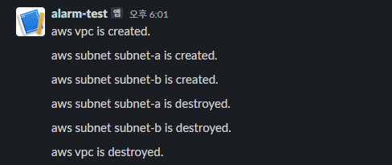

# 개요
* local-exec 프로비저너를 사용하여 python API 호출

# 시나리오
* aws vpc, subnet 생성할 때 python API호출
* aws vpc, subnet 삭제할 때 python API호출
* python API는 slack에 메세지 전송



# 전제조건
* slack app 생성
* slack webhook 주소 생성

# 프로젝트 목록
* [slack 메세지를 전송하는 python API](./python_slack_notifcation_api/)
* [테라폼 코드](./terraform/)

# 프로젝트 실행 방법
* 1. python api 실행
```bash
cd python_slack_notifcation_api

# 파이썬 패키지 설치
pip install -r requirements.txt

# wbehook 주소 설정
export SLACK_WEBHOOK="https://hooks.slack.com/services/{your-webhook-url}"

# Fastapi 실행
uvicorn main:app --host 127.0.0.1 --port 8000
```

* 2. 테라폼 코드 실행
```bash
# 테라폼 초기화
terraform init

# 리소스 생성
terraform apply

# 리소스 삭제
terraform destroy
```